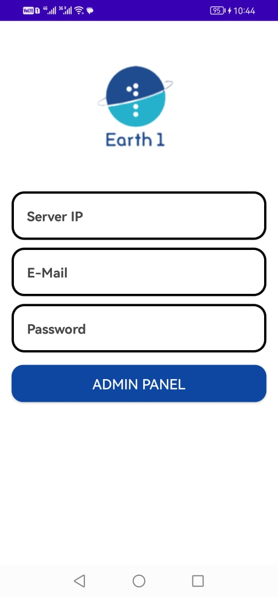
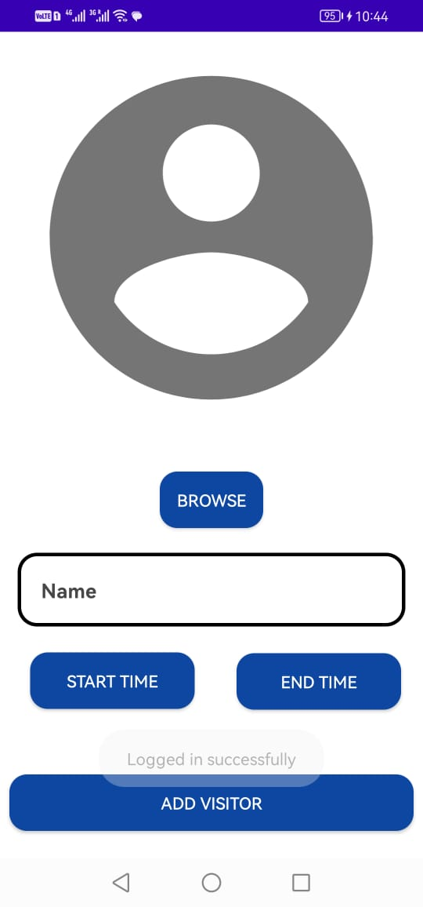

# Visitor

## Overview

Visitor is a powerful mobile application designed for smartphones, serving as a comprehensive Visitor Management solution. The app empowers users to seamlessly manage visitor information, including adding visitors with their photos, names, and visiting times. Utilizing Megvii face APIs, the app connects with Megvii servers for facial recognition. Once a visitor's information is added, they can show their face on a Face terminal for recognition, granting access through security gates. Developed in Java, the app supports functionalities for creating, deleting, and updating visitor details.

## Features

- **Visitor Management:** Allows users to add, delete, and update visitor information with ease.
- **Facial Recognition:** Utilizes Megvii face APIs for accurate and secure facial recognition.
- **Security Gate Access:** Enables visitors to gain access through security gates via facial recognition.
- **Data Synchronization:** Syncs visitor data with Megvii servers for seamless integration.
- **User-friendly Interface:** Provides an intuitive interface for efficient visitor management.

## Technology Stack

- **Language:** Java
- **Facial Recognition APIs:** Megvii Face APIs

## Project Responsibilities

- **Android App Development:** Developed the Android application using Java, focusing on an intuitive and user-friendly interface for efficient visitor management.
- **Megvii Face API Integration:** Integrated Megvii face APIs to connect with Megvii servers for secure and accurate facial recognition.
- **Visitor Data Sync:** Implemented data synchronization with Megvii servers for seamless integration.
- **Security Gate Access:** Enabled visitors to gain access through security gates via facial recognition.

## Outcome

Visitor has proven to be a robust Visitor Management solution, providing users with a streamlined process for managing visitor information and enhancing security through facial recognition. The integration with Megvii face APIs ensures accurate and secure recognition, and the user-friendly interface enhances the overall visitor management experience.

## Screenshots

